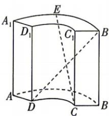

<!-- question-source:start -->
5. 新考法 创新载体 [北京二中 2026 高二月考] 中国古代数学著作《九章算术》中记载了一种被称为“曲池”的几何体。该几何体是上、下底面均为扇环形的柱体（扇环是指圆环被扇形截得的部分）。在如图所示的“曲池”中， $AA_{1} \perp$ 平面 $A_{1}B_{1}C_{1}D_{1}$ ，记弧 $AB$ ，弧 $DC$ 的长度分别为 $l_{1}, l_{2}$ ，已知 $AA_{1} = 3AD = 3, l_{1} = 2l_{2} = \frac{4\pi}{3}, E$ 为弧 $A_{1}B_{1}$ 的中点，则直线 $CE$ 与 $DB_{1}$ 所成角的余弦值为（）

A. $\frac{\sqrt{181}}{16}$ B. $\frac{5\sqrt{3}}{16}$ C. $\frac{5\sqrt{2}}{12}$ D. $\frac{\sqrt{94}}{12}$
<!-- question-source:end -->

![[Q00071995A1]]
