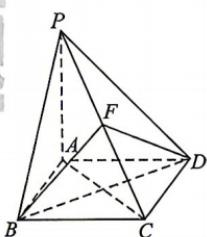

<!-- question-source:start -->
6. 如图, 已知 P 为菱形 ABCD 所在平面外一点, 且 PA⊥平面 ABCD, PA=AD=AC, F 为 PC 的中点, 则二面角 C-BF-D 的正切值为 ( )

A. $\frac{\sqrt{3}}{6}$ B. $\frac{\sqrt{3}}{4}$ C. $\frac{\sqrt{3}}{3}$ D. $\frac{2\sqrt{3}}{3}$
<!-- question-source:end -->

![[Q00071996A1]]
