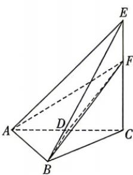

<!-- question-source:start -->
14. 如图, 在三棱锥 $E - ABC$ 中, 平面 $ACE \perp$ 平面 $ABC$ , $AC = CE = 2AB = 12$ , $\angle BAC = \frac{\pi}{3}$ , $AC \perp CE$ , $D$ 为 $AC$ 的中点, $F$ 是 $CE$ 上的一个动点, 则三棱锥 $B - ADF$ 最小值为 \_\_\_\_.

一个动点,则三棱锥 B-ADF 外接球表面积的最小值为 \_\_\_\_.

## 四、解答题：本大题共5小题，共77分. 解答应写出文字说明、证明过程或演算步骤.
<!-- question-source:end -->

![[Q00072004A1]]
