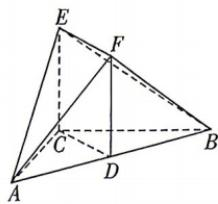

<!-- question-source:start -->
17.（本小题满分15分）[北京朝阳区2025高二期末]如图，在六面体ABCEF中，D为AB的中点，四边形CDFE为矩形，且 $EC\perp CB$ ， $AC\perp CB,AC=CB=4$ .
(1) 求证: $EC \perp$ 平面 ABC.
(2) 再从条件①, 条件②, 条件③这三个条件中选择一个作为已知, 求平面 EAF 与平面 ECB 夹角的余弦值.
条件①: AE = 5;
条件②: $\triangle ABF$ 的面积为 $6\sqrt{2}$ ;
条件③: 六面体 ABCEF 的体积为 16.
注: 如果选择多个条件分别解答, 按第一个解答计分.

<!-- question-source:end -->

![[Q00072007A1]]
