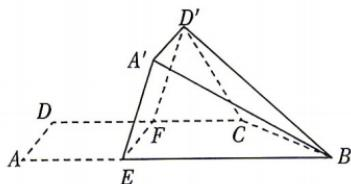

<!-- question-source:start -->
5. 教材 变式 [全国二 2025·17, 15 分] 如图, 在四边形 ABCD 中, $AB \parallel CD$ , $\angle DAB = 90^{\circ}$ . F 为 CD 的中点, 点 E 在 AB 上, $EF \parallel AD$ , AB = 3AD, CD = 2AD, 将四边形 EFDA 沿 EF 翻折至四边形 $EFD'A'$ , 使得面 $EFD'A'$ 与面 EFCB 所成的二面角为 $60^{\circ}$ .
(1)证明: $A'B//$ 平面 $CD'F$ ;
(2)求面 $BCD'$ 与面 $EFD'A'$ 所成的二面角的正弦值.

## 刷原创
<!-- question-source:end -->

![[Q00072014A1]]
