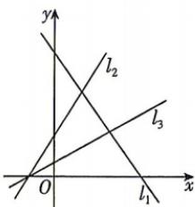

<!-- question-source:start -->
4.[河南信阳2026高二月考]已知图中的直线 $l_{1},l_{2},l_{3}$ 的斜率分别为 $k_{1},k_{2},k_{3}$ ，则（）

A. $k_{1} < k_{2} < k_{3}$ B. $k_{3} < k_{1} < k_{2}$ C. $k_{3} < k_{2} < k_{1}$ D. $k_{1} < k_{3} < k_{2}$
<!-- question-source:end -->

![[Q00072031A1]]
