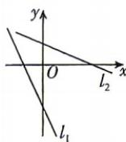
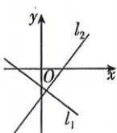
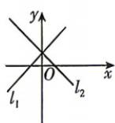
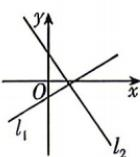

<!-- question-source:start -->
4.[四川绵阳南山中学2025高二月考]两条直线 $l_{1}:\frac{x}{a}-\frac{y}{b}=1$ 和 $l_{2}:\frac{x}{b}-\frac{y}{a}=1$ 在同一平面直角坐标系中可以是()

A

B

C

D

不论你在什么时候开始，重要的是开始之后就不要停止。

答案P133
<!-- question-source:end -->

![[Q00072051A1]]
