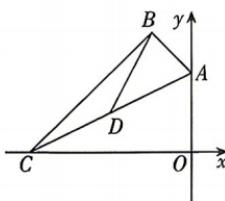

<!-- question-source:start -->
7. 如图, 已知 $\triangle ABC$ 的三个顶点分别为 $A(0, 4), B(-2,6), C(-8,0)$ . (1) 求边 $AC$ 和边 $AB$ 所在直线的方程; (2) 求 $AC$ 边上的中线 $BD$ 所在直线与坐标轴围成的三角形的面积.

## 刷易错

## 易错点 忽视直线截距为0的特殊情况致误
<!-- question-source:end -->

![[Q00072054A1]]
