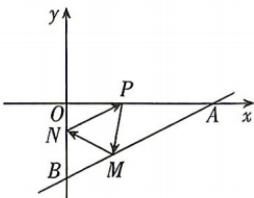

<!-- question-source:start -->
7.[山西省实验中学2025高二段考]如图,已知点A(8,0),B(0,-4),从点P(3,0)射出的光线经直线

AB 反射后射到直线 OB 上, 最后经直线 OB 反射后又回到点 P, 则光线所经过的路程是 \_\_\_\_.

## 题型3 线关于点对称
<!-- question-source:end -->

![[Q00072118A1]]
