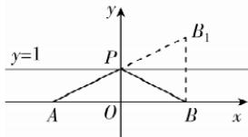

> [!faq]- 答案与解析
>
> > [!success]- **【答案】** D
>
> > [!note]- **【解析】**
> > D 【解析】依题意,线段 PQ 的中点为 $(2,4)$ , $|PQ|=2$ , 圆 C 经过 $P(1,4)$ , $Q(3,4)$ 两点, 当圆 C 的半径最小时, 线段 PQ 为圆 C 的直径, 此时圆 C 的方程为 $(x-1)(x-3)+(y-4)(y-4)=0$ , 化简得标准方程为 $(x-2)^{2}+(y-4)^{2}=1$ . 故选 D.
> >
> > 规律方法 若 $A(x_{1},y_{1})$ , $B(x_{2},y_{2})$ , 则以线段 AB 为直径的圆的方程是 $(x-x_{1})(x-x_{2})+(y-y_{1})(y-y_{2})=0$ .
> >
> > 作 $B(2,0)$ 关于直线 $y = 1$ 的对称点 $B_{1}$ ，则 $B_{1}(2,2)$ 故 $\mid PA\mid +\mid PB\mid = \mid PA\mid +\mid PB_1\mid \geqslant$ $|AB_{1}| = \sqrt{(2 + 2)^{2} + (2 - 0)^{2}} = 2\sqrt{5}$ 当且仅当 $A,P,B_{1}$ 三点共线时取等号，故 $f(x)$ 的最小值是 $2\sqrt{5}$ .故选C.
> >
> > 
