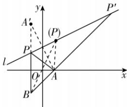

> [!faq]- 答案与解析
>
> > [!success]- **【答案】** AC
>
> > [!note]- **【解析】**
> > AC 【解析】设 $A'(a,b)$ 是 $A(2,0)$ 关于 l: x - 2y + 8 = 0 的对称点，则 $\left\{\begin{aligned}\frac{b}{a-2}&=-2,\\ \frac{a+2}{2}&-2\times\frac{b}{2}+8=0,\end{aligned}\right.$ 所以 $\left\{\begin{aligned}a&=-2,\\ b&=8,\end{aligned}\right.$ 即 $A'(-2,8)$ ，所以 $|PA'|=|PA|$ ，则 $|PA|+|PB|=|PA'|+|PB|\geqslant|A'B|=12$ ，当且仅当 B, P, $A'$ 共线且 P 在线段 $A'B$ 上时取等号，即 $|PA|+|PB|$ 的最小值为 12。由图知 $-|AB|\leqslant|PA|-|PB|<|AB|$ ，即 $-4\sqrt{2}\leqslant|PA|-|PB|<4\sqrt{2}$ ，当点悟：直线 AB 与直线 l 的交点离 A 点更近
> >
> > 且仅当 B, P, A 共线且 P 在射线 BA 上（图中点 $P'$ 处）时取最小值，但无最大值，即 $|PA|-|PB|$ 的最小值是 $-4\sqrt{2}$ 。故选 AC。
> >
> > 
