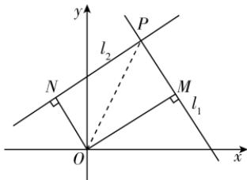

> [!faq]- 答案与解析
>
> > [!success]- **【答案】** D
>
> > [!note]- **【解析】**
> > D 【解析】将直线 $l_{1}$ 的方程变形得 $x-1+m(2-y)=0$ ，由 $\left\{\begin{aligned}x-1&=0,\\ 2-y&=0,\end{aligned}\right.$ 得 $\left\{\begin{aligned}x&=1,\\ y&=2,\end{aligned}\right.$ 则直线 $l_{1}$ 过定点 $(1,2)$ ，同理可知，直线 $l_{2}$ 过定点 $(1,2)$ ，所以直线 $l_{1}$ 和直线 $l_{2}$ 的交点 P 的坐标为 $(1,2)$ ，由 $1\times m+(-m)\times1=0$ 可知直线 $l_{1}\perp l_{2}$ ，如图所示，连接 OP.
> >
> > →点悟：求面积问题时一般先判断直线是否垂直
> >
> > 
> >
> > 所以四边形 OMPN 为矩形，且 $\left|OP\right|=\sqrt{1^{2}+2^{2}}=\sqrt{5}$ .
> > 设 $|OM|=a,|ON|=b$ ，则 $a^{2}+b^{2}=5$ ，四边形 OMPN 的面积 $S=|OM|\cdot|ON|=ab\leqslant\frac{a^{2}+b^{2}}{2}=\frac{5}{2}$ ，当且仅当 $\left\{\begin{aligned}&a=b,\\ &a^{2}+b^{2}=5,\end{aligned}\right.$ 即 $a=b=\frac{\sqrt{10}}{2}$ 时，等号成立，因此，四边形 OMPN 面积的最大值为 $\frac{5}{2}$ ，
> >
> > 故选 **D**.
