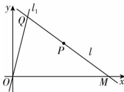

> [!faq]- 答案与解析
>
> > [!success]- **【答案】** C
>
> > [!note]- **【解析】**
> > $x+y-10=0$
> >
> > 思路导引 根据题意,画出平面直角坐标系及点的位置,根据直线 l 过点 P 设出直线 l 的方程,分别求出点 Q 的纵坐标及点 M 的横坐标,从而用代数式表示出 $\triangle OQM$ 的面积,进而可求出最小值.注意分直线斜率存在和不存在两种情况讨论.
> > 【解析】当直线 l 的斜率不存在时, 直线 l 的方程为 x = 6, 由 $\left\{\begin{aligned}x=6,\\ y=4x\end{aligned}\right.$ 得 $\left\{\begin{aligned}x=6,\\ y=24,\end{aligned}\right.$ 即 $Q(6,24)$ , 又易知 $M(6,$
> >
> > ## 2.4 圆的方程
> >
> > $\sqrt{(2m + 1 + 7)^2 + (m + 5)^2}$ ，解得 $m = -2$ ，故圆心 $M(-3, -2)$ ，半径为 $\sqrt{(-3 - 1)^2 + (-2 - 1)^2} = 5$ ，故圆 $M$ 的标准方程为 $(x + 3)^2 + (y + 2)^2 = 25.$ 故选C.
> >
> > 链接教材 本题是教材第84页例3的变式,根据平面几何知识可知若圆经过A,B两点,则圆心必在线段AB的垂直平分线上.
> >
> > 0), 所以 $\triangle OQM$ 的面积 $S = \frac{1}{2} \times 6 \times 24 = 72$ .
> >
> > 当直线 $l$ 的斜率存在时, 不妨设直线 $l$ 的方程为 $y - 4 = k(x - 6) (k \neq 0)$ , 令 $y = 0$ , 得 $x = 6 - \frac{4}{k}$ , 又由 $\left\{ \begin{array}{l} y = 4x, \\ y - 4 = k(x - 6), \end{array} \right.$ 消去 $x$ 得 $y = \frac{24k - 16}{k - 4}$ .
> >
> > 由题知 $\left\{ \begin{array}{l} 6 - \frac{4}{k} > 0, \\ \frac{24k - 16}{k - 4} > 0, \end{array} \right.$ 解得 $k < 0$ 或 $k > 4$ ,
> >
> > 此时 $\triangle OQM$ 的面积 $S = \frac{1}{2} \times \left(6 - \frac{4}{k}\right) \times \frac{24k - 16}{k - 4} = \frac{8(3k - 2)^2}{k^2 - 4k}$ .
> >
> > 令 $3k - 2 = t$ , 得 $k = \frac{t + 2}{3}$ , 则 $S = \frac{8(3k - 2)^2}{k^2 - 4k} = \frac{8t^2}{\frac{(t + 2)^2}{9} - \frac{4(t + 2)}{3}} = \frac{72t^2}{t^2 - 8t - 20} = \frac{72}{1 - \frac{8}{t} - \frac{20}{t^2}}$ .
> >
> > 又因为 $1 - \frac{8}{t} - \frac{20}{t^2} = -20\left(\frac{1}{t} + \frac{1}{5}\right)^2 + \frac{9}{5}$ , 且 $k = \frac{t + 2}{3} < 0$ 或 $k = \frac{t + 2}{3} > 4$ , 即 $t < -2$ 或 $t > 10$ , 故 $-\frac{1}{2} < \frac{1}{t} < 0$ 或 $0 < \frac{1}{t} < \frac{1}{10}$ , 所以 $0 < -20\left(\frac{1}{t} + \frac{1}{5}\right)^2 + \frac{9}{5} \leqslant \frac{9}{5}$ , 故 $S = \frac{72}{1 - \frac{8}{t} - \frac{20}{t^2}} \geqslant \frac{72}{9} = 40$ , 当且仅当 $t = -5$ , 即 $k = -1$ 时取等号.
> >
> > 因为 $40 < 72$ , 所以使 $\triangle OQM$ 面积最小的直线 $l$ 的方程为 $y - 4 = -(x - 6)$ , 即 $x + y - 10 = 0$ .
> >
> > 
