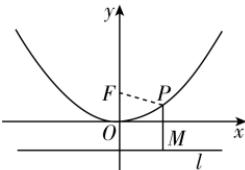

> [!faq]- 答案与解析
>
> > [!success]- **【答案】** B
>
> > [!note]- **【解析】**
> > B 【解析】设点 $P(x, y)$ ，则点 $M(x, -1)$ 。连接 PF，由题意知 $\left|PF\right| = \left|PM\right|$ ，即 $\sqrt{x^{2} + (y - 1)^{2}} = |y + 1|$ ，整理得 $x^{2} = 4y$ ，则曲线 C 的方程为 $x^{2} = 4y$ 。故选 B.
> >
> > 
> >
> > 多种解法 由题意知, 点 P 到点 $F(0,1)$ 的距离等于其到直线 y = -1 的距离, 则点 P 的轨迹为以点 $F(0,1)$ 为焦点, 以直线 y = -1 为准线的抛物线, 则曲线 C 的方程为 $x^{2} = 4y$ .
> >
> > 故选 **B**.
