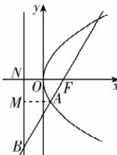

> [!faq]- 答案与解析
>
> > [!success]- **【答案】** B
>
> > [!note]- **【解析】**
> > B 【解析】作出示意图如图所示.
> > 因为直线 BF 的倾斜角为 $\frac{\pi}{3}$ ，所以$\angle AFO = \frac{\pi}{3}$ ，过点 A 作 AM 垂直准线于点 M，点 N 为准线与 x 轴的交点，所以 $\angle BAM = \frac{\pi}{3}$ ，因为 $|AB| = 2$ ，所以 $|AM| =$ 所以 $|FB| = 3$ ，所以 $p = \frac{3}{2}$ 。故选 B.
> >
> > 
> >
> > $|AB|=2$ , 所以 $|AM|=1$ , 所以 $|AF|=1$ ,
> > 所以 $|FB|=3$ ，所以 $|FN|=\frac{3}{2}$ ，所以 $p=\frac{3}{2}$ .
> >
> > 故选 **B**.
