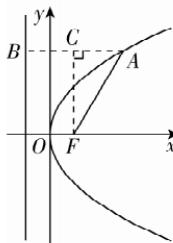
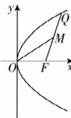

> [!faq]- 答案与解析
>
> > [!success]- **【答案】** C
>
> > [!note]- **【解析】**
> > C 【解析】作抛物线及其准线如图所示, 过点 A 作 AB 垂直准线于点 B, 过焦点 F 作 FC 垂直 AB 于点 C, 由题意可知 p=2, $\angle AFx = \angle FAC = \frac{\pi}{3}$ , 根据抛物线的定
> >
> > 
> >
> > 义可知 $|AF|=|AB|=|AC|+|CB|$ . 在Rt△AFC中， $|AC|=|AF|\cdot\cos\frac{\pi}{3}=\frac{1}{2}|AF|$ ，又 $|BC|=p=2$ ，所以 $|AF|=|AB|=\frac{1}{2}|AF|+2$ ，解得 $|AF|=4$ 。故选C.
> >
> > 
