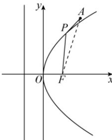
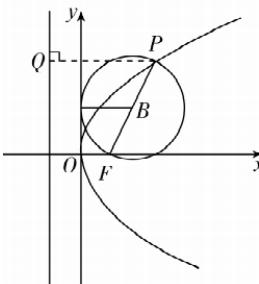

> [!faq]- 答案与解析
>
> > [!success]- **【答案】** ACD
>
> > [!note]- **【解析】**
> > ACD 【解析】对于 A, 抛物线的准线方程为 $x = -\frac{4}{4} = -1$ , 故 A 正确;
> > 对于 B, 设 $P(x_{0}, y_{0})$ , 则 $x_{0} \geqslant 0, y_{0}^{2} = 4x_{0}$ , $F(1, 0)$ , 则 $\left|PF\right| = \sqrt{\left(x_{0}-1\right)^{2} + y_{0}^{2}} = x_{0} + 1 \geqslant 1$ , 当 $x_{0} = 0$ 时取得最小值, 此时 P 与原点重合, 故 B 错误;
> > 对于 C, A 在抛物线外部, 如图①所示, 故当 P, A, F 三点共线, 且点 P 是线段 AF 与抛物线的交点时, $\left|PA\right| + \left|PF\right|$ 取得最小值, 为 $\left|AF\right| = \sqrt{(2-1)^{2} + (3-0)^{2}} = \sqrt{10}$ , 故 C 正确;
> >
> > 
> > 图①
> >
> > 对于 D, 过点 P 作准线的垂线, 垂足为 Q, 如图②所示,
> > 设 $P(m,n)$ , 线段 PF 的中点为 $B(x_{1}, y_{1})$ , 可得 $x_{1}=\frac{1}{2}(1+m)$ , 由抛物线的定义得 $|PF|=|PQ|=m+1$ ,
> > 所以 $x_{1}=\frac{1}{2}|PF|$ ，即点 B 到 y 轴的距离等于以线段 PF 为直径的圆的半径，因此，以线段 PF 为直径的圆与 y 轴相切，故 D 正确.
> > → 敲黑板：当抛物线的焦点在 $x(y)$ 轴上时，以抛物线焦半径为直径的圆与 $y(x)$ 轴相切
> > 故选 ACD
> >
> > 
> > 图②
