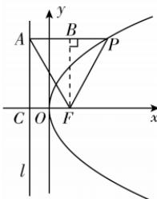

> [!faq]- 答案与解析
>
> > [!success]- **【答案】** D
>
> > [!note]- **【解析】**
> > D 【解析】由题知 $F(1,0)$ ，准线 l: x = -1，设准线 l 与 x 轴的交点为 C，点 P 在 D 上，则由抛物线的定义及已知得 $|PA| = |AF| = |PF|$ ，则 $\triangle PAF$ 为等边三角形，如图所示.
> >
> > 
> >
> > 方法一: 因为 $\angle APF = \frac{\pi}{3}$ , $AP \parallel x$ 轴, 所以直线 PF 的斜率 $k = \sqrt{3}$ , 所以直线 $PF: y = \sqrt{3}(x - 1)$ , 由 $\left\{\begin{aligned} y^{2} &= 4x, \\ y &= \sqrt{3}(x - 1), \end{aligned}\right.$ 解得 $P(3, 2\sqrt{3})$ 或 $P\left(\frac{1}{3}, -\frac{2\sqrt{3}}{3}\right)$ (舍去),
> >
> > → 点悟: 此时不满足 $|PA| = |AF|$ 所以 $|PF| = x_{p} + \frac{p}{2} = 3 + 1 = 4$ . 故选 D.
> >
> > 所以 $4c^{2}=c^{2}+(2a+c)^{2}-2c\cdot(2a+c)\cdot\left(-\frac{a}{c}\right)$ ,
> > 所以 $c^{2}-3ac-4a^{2}=0$ ，即 $e^{2}-3e-4=0$ ，
> > → 点悟：对于 a, c 的二次齐次式，可将等式两边同时除以 $a^{2}$ 求出 e 解得 e=4 或 e=-1（舍去），所以双曲线的离心率为 4.
> >
> > 方法二：在 Rt $\triangle ACF$ 中， $|CF|=2$ ， $\angle AFC=\frac{\pi}{3}$ ，则 $|AF|=|PF|=4$ 。故选 D。
> > 方法三: 过点 F 作 $FB \perp AP$ 于点 B，则 B 为 AP 的中点，因为 $|AB|=2$ ，所以 $|AP|=|PF|=4$ 。
> >
> > 故选 **D**.
