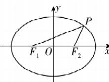

> [!faq]- 答案与解析
>
> > [!success]- **【答案】** D
>
> > [!note]- **【解析】**
> > D 【解析】设 $M(x_{0}, y_{0})$ ，椭圆 $C_{1}$ 的方程为 $\frac{x^{2}}{a_{1}^{2}} + \frac{y^{2}}{b_{1}^{2}} = 1$ ，椭圆 $C_{2}$ 的方程为 $\frac{x^{2}}{a_{2}^{2}} + \frac{y^{2}}{b_{2}^{2}} = 1$ ，则有 $\frac{x_{0}^{2}}{a_{1}^{2}} + \frac{y_{0}^{2}}{b_{1}^{2}} = 1$ ①.
> > 由极线的定义得直线 l 的方程为 $\frac{x_{0}x}{a_{2}^{2}} + \frac{y_{0}y}{b_{2}^{2}} = 1$ ,
> > 原点 O 到直线 l 的距离 $d=\frac{1}{\sqrt{\frac{x_{0}^{2}}{a_{2}^{4}}+\frac{y_{0}^{2}}{b_{2}^{4}}}}=1$ ，化简得 $\frac{x_{0}^{2}}{a_{2}^{4}}+\frac{y_{0}^{2}}{b_{2}^{4}}=1$ ②.
> > 对比①②式得出 $a_{1}^{2}=a_{2}^{4}, b_{1}^{2}=b_{2}^{4}$ ，则有 $e_{1}^{2}=1-\frac{b_{1}^{2}}{a_{1}^{2}}=1-\frac{b_{2}^{4}}{a_{2}^{4}}=\left(1-\frac{b_{2}^{2}}{a_{2}^{2}}\right)\left(1+\frac{b_{2}^{2}}{a_{2}^{2}}\right)=e_{2}^{2}(2-e_{2}^{2})$ 所以 $e_{1}^{2}-e_{2}^{2}=e_{2}^{2}(1-e_{2}^{2})\leqslant\left(\frac{e_{2}^{2}+1-e_{2}^{2}}{2}\right)^{2}=\left(\frac{1}{2}\right)^{2}=\frac{1}{4}.$ 当且仅当 $e_{2}^{2}=1-e_{2}^{2}$ ，即 $e_{2}=\frac{\sqrt{2}}{2}$ 时取等号，此时 $e_{1}=\frac{\sqrt{3}}{2}$ . 故选 D.
> >
> > 规律方法 解决圆锥曲线中最值与范围问题的方法(1)几何法：若题目的条件和结论能明显体现几何图形的特征及意义，则考虑利用曲线的定义、几何性质以及
> >
> > ## 专题 7 圆锥曲线中的范围、最值问题
> >
> > 平面几何中的定理、性质等进行求解.
> > (2)代数法:若题目的条件和结论能体现一种明确的函数关系,则可首先建立目标函数,再求这个函数的最值与范围,求函数最值的常用方法有配方法、判别式法、基本不等式法及函数的单调性法等.
> >
> > 
