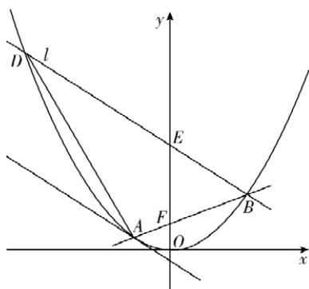
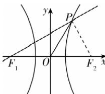
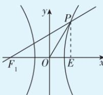

> [!faq]- 答案与解析
>
> > [!success]- **【答案】** A
>
> > [!note]- **【解析】**
> > A 【解析】设双曲线的右焦点为 $F_{2}$ ，连接 $PF_{2}$ ，如图所示。∵ P 在双曲线的右支上， $\therefore |PF_{1}| - |PF_{2}| = 2a.$
> >
> > 
> >
> > 
> >
> > ∵ 双曲线 $\frac{x^{2}}{a^{2}} - \frac{y^{2}}{b^{2}} = 1$ 的左焦点 $F_{1}(-c,0)$ ，且 $\triangle POF_{1}$ 为等腰三角形， $\angle POF_{1}>90^{\circ},\therefore|OF_{1}|=|OP|=c,$ 点悟：∵P在右支上，
> > ∴ $\angle POF_{1}$ 一定为钝角 $\therefore \angle PF_{1}O = \angle F_{1}PO = 30^{\circ}, \therefore \angle POF_{2} = 60^{\circ}.$ 又∵ $|OF_{1}| = |OF_{2}| = |OP| = c,$ ∴ $\triangle POF_{2}$ 为等边三角形，则 $\angle F_{2}PO = 60^{\circ}, |PF_{2}| = c,$ ∴ $\angle F_{1}PF_{2} = \angle F_{1}PO + \angle F_{2}PO = 90^{\circ}.$ 在 Rt△F₁PF₂ 中，|PF₂|=c, |F₁F₂|=2c, 可得 |PF₁|=√3c,
> > ∴ |PF₁|-|PF₂|=√3c-c=2a, 即(√3-1)c=2a, 则 e= $\frac{c}{a}=\sqrt{3}+1.$
> >
> > 多种解法 如图所示, 过点 P 作 $PE \perp x$ 轴于点 E.
> >
> > 
> >
> > $\because$ 双曲线 $\frac{x^2}{a^2} -\frac{y^2}{b^2} = 1$ 的左焦点 $F_{1}(-c,0)$ ，且 $\triangle POF_{1}$ 为等腰三角形， $\angle POF_1 > 90^\circ$ $\therefore |OF_1| = |OP| = c,\angle PF_1O =$ $\angle F_1PO = 30^\circ ,\therefore \angle POE = 60^\circ .$ $\therefore$ 在 Rt $\triangle POE$ 中， $|OE| = \frac{c}{2},$ $|PE| = \frac{\sqrt{3}c}{2}$ ，则 $P\left(\frac{c}{2},\frac{\sqrt{3}c}{2}\right).$
> >
> > ∵ 点 P 在双曲线 $\frac{x^{2}}{a^{2}} - \frac{y^{2}}{b^{2}} = 1$ 上， $\therefore \frac{\left(\frac{c}{2}\right)^{2}}{a^{2}} - \frac{\left(\frac{\sqrt{3}c}{2}\right)^{2}}{b^{2}} = 1$ ，化简得 $b^{2}c^{2} - 3a^{2}c^{2} = 4a^{2}b^{2}$ $\therefore (c^{2}-a^{2})c^{2}-3a^{2}c^{2}=4a^{2}(c^{2}-a^{2})$ ，即 $c^{4}-8a^{2}c^{2}+4a^{4}=0$ ，等式两边同时除以 $a^{4}$ ，得 $\frac{c^{4}}{a^{4}}-\frac{8c^{2}}{a^{2}}+4=0.$ 令 $t=\frac{c^{2}}{a^{2}}(t>1)$ ，即 $t^{2}-8t+4=0$ ，解得 $t=4+2\sqrt{3}$ ，即 $e^{2}=4+2\sqrt{3}$ $\because e>1,\therefore e=\sqrt{3}+1.$
> >
> > 故选 **A**.
