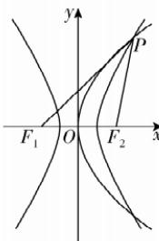

> [!faq]- 答案与解析
>
> > [!success]- **【答案】** A
>
> > [!note]- **【解析】**
> > A 【解析】由双曲线定义得 $|PF_{2}| = |PF_{1}| - 2a = 3c - a$ ，设点 $P(x_0, y_0)$ ，由 [188]
> >
> > 抛物线定义得 $\left|PF_{2}\right|=x_{0}+c$ ，解得 $x_{0}=2c-a,y_{0}^{2}=4cx_{0}=4c(2c-a)$ ，又点P
> > 在双曲线上，则 $\frac{x_{0}^{2}}{a^{2}}-\frac{y_{0}^{2}}{b^{2}}=1$ ，即 $\frac{(2c-a)^{2}}{a^{2}}-$
> >
> > 
> >
> > $\frac{4c(2c-a)}{c^{2}-a^{2}}=1$ ，又 $\frac{c}{a}=e>1$ ，于是 $(2e-1)^{2}-\frac{8e^{2}-4e}{e^{2}-1}=1$ ，整理得 $e^{3}-e^{2}-3e+2=0$ ，即 $(e-2)(e^{2}+e-1)=0$ ，而 $e^{2}+e>2$ ，所以e=2，即双曲线的离心率为2.
> >
> > 故选 **A**.
