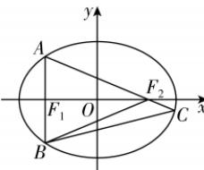
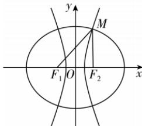

> [!faq]- 答案与解析
>
> > [!success]- **【答案】** D
>
> > [!note]- **【解析】**
> > D 【解析】由 $S_{\triangle ABC} = 5S_{\triangle BCF_{2}}$ ，可得 $\frac{S_{\triangle ABC}}{S_{\triangle BCF_{2}}} = \frac{|AC|}{|CF_{2}|} = 5$ ，故 $\overrightarrow{AF_{2}} = 4\overrightarrow{F_{2}C}$ ，且 $F_{2}(c,0)$ .
> >
> > 不妨设点 A 在第二象限, 将 x = -c 代入椭圆方程得 $\frac{c^{2}}{a^{2}} +$
> >
> > 
> >
> > $\frac{y^{2}}{b^{2}}=1$ , 解得 $y=\pm\frac{b^{2}}{a}$ ，即点 $A\left(-c,\frac{b^{2}}{a}\right)$ .
> > 设点 $C(x_{0},y_{0})$ ，由 $\overrightarrow{AF_{2}}=4\overrightarrow{F_{2}C}$ 得 $\left(2c,-\frac{b^{2}}{a}\right)=4\left(x_{0}-c,y_{0}\right)$ ，即 $\left\{\begin{aligned}&4(x_{0}-c)=2c,\\ &4y_{0}=-\frac{b^{2}}{a},\end{aligned}\right.$ 解得 $\left\{\begin{aligned}&x_{0}=\frac{3c}{2},\\ &y_{0}=-\frac{b^{2}}{4a},\end{aligned}\right.$ 即点 $C\left(\frac{3c}{2},-\frac{b^{2}}{4a}\right)$ ，将点 C 的坐标代入椭圆方程得 $\frac{9c^{2}}{4a^{2}}+\frac{b^{2}}{16a^{2}}=1$ ，即 $\frac{9c^{2}}{4a^{2}}+\frac{a^{2}-c^{2}}{16a^{2}}=1$ ，故有 $\frac{9}{4}e^{2}+\frac{1}{16}(1-e^{2})=1$ ，解得 $e=\frac{\sqrt{21}}{7}$ . 故选 D.
> >
> > $$
> > \left[ \frac {2}{5}, \frac {7}{1 6} \right]
> > $$
> >
> > 思路导引 由题意结合椭圆与双曲线的定义分别表示出 $|MF_{1}|,|MF_{2}|$ 的长度,再根据题中椭圆和双曲线有公共焦点的关系,结合离心率的定义得到椭圆与双曲线离心率之间的关系式,从而求出椭圆离心率的取值范围.
> > 【解析】如图,设椭圆的方程为 $\frac{x^{2}}{a^{2}}+\frac{y^{2}}{b^{2}}=$
> >
> > $1(a > b > 0)$ , 双曲线的方程为 $\frac{x^2}{m^2} - \frac{y^2}{n^2} = 1(m > 0, n > 0)$ , 椭圆和双曲线的半焦距为 $c$ , 设 $|MF_1| = s, |MF_2| = t$ , 由题意可得 $t = |F_1F_2| = 2c$ , 由椭圆的定义, 可得 $s + t = 2a$ , 由双曲线的定义, 可得 $s - t = 2m$ , 解得 $t = a - m$ . 设椭圆的离心率为 $e', e' = \frac{c}{a}, e = \frac{c}{m}$ , 因为 $a - m = 2c$ , 两边同除以 $c$ , 得 $\frac{a}{c} - \frac{m}{c} = 2$ , 即有 $\frac{1}{e'} - \frac{1}{e} = 2$ , 由 $e \in \left[2, \frac{7}{2}\right]$ , 得 $\frac{1}{e} \in \left[\frac{2}{7}, \frac{1}{2}\right]$ , 则 $\frac{1}{e'} = 2 + \frac{1}{e} \in \left[\frac{16}{7}, \frac{5}{2}\right]$ , 则 $e' \in \left[\frac{2}{5}, \frac{7}{16}\right]$ .
> >
> > 
> >
> > ## 规律方法 求离心率的常用方法
> >
> > (1) 构造 a, c 的齐次式, 解出 e
> > 根据题设条件, 借助 a, b, c 之间的关系, 构造 a, c 的关系 (特别是齐二次式), 进而得到关于 e 的一元方程, 从而解得离心率 e.
> > (2) 通过求定点坐标——根据点在曲线上求解离心率
> > 标准方程是圆锥曲线的量化体现之一, 点 $P(x_{0}, y_{0})$ 在圆锥曲线上, 除了满足圆锥曲线的定义外, 其坐标也应满足曲线的方程, 因此用 a, b, c 刻画点 P 的坐标后, 将其代入曲线方程也是解决离心率问题的有效途径之一.
> > (3) 利用圆锥曲线定义求离心率.
> >
> > (4) 利用平面几何的性质
> > 很多离心率问题是以平面图形为载体出现的, 平面图形背后有一些隐含的性质, 比如三角形面积的等价转化, 三角形两边之和大于第三边, 垂线段最短等.
> > (5)以 e 为函数式, 利用配方、换元等方法求函数的值域, 也是求离心率常用的方法.
> >
> > ## 专题6 圆锥曲线中的中点弦、对称问题
> >
> > ## 刷难关
