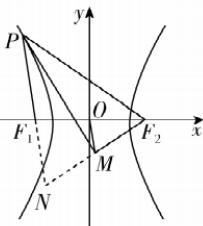

> [!faq]- 答案与解析
>
> > [!success]- **【答案】** A
>
> > [!note]- **【解析】**
> > A 【解析】由 $\left|F_{1}F_{2}\right|=2c=6$ , 得 c=3
> >
> > 设 $PF_{1}$ 与 $F_{2}M$ 的延长线交于点 N，如图，由直线 PM 平分 $\angle F_{1}PF_{2}$ ，且 $F_{2}M \perp PM$ ，可得 $\triangle PF_{2}N$ 为
> >
> > 
> >
> > 等腰三角形, 则 M 为 $F_{2}N$ 的中点, 可得 $\left|F_{1}N\right|=2\left|OM\right|=2\sqrt{3}$ , 又因为 $\left|PF_{2}\right|=\left|PN\right|=\left|PF_{1}\right|+\left|F_{1}N\right|=\left|PF_{1}\right|+2\sqrt{3}$ , 可得 $\left|PF_{2}\right|-\left|PF_{1}\right|=2a=2\sqrt{3}$ , 即 $a=\sqrt{3}$ , 所以双曲线 E 的离心率为 $e=\frac{c}{a}=\sqrt{3}$ . 故选 A.
> >
> > 思路导引
> > 设 $|PF_{2}|=t$ ，则 $|PF_{1}|=\lambda t$ ，根据椭圆定义得到 $(\lambda+1)t=2a①$ 根据 $\overrightarrow{PF_{1}}\cdot\overrightarrow{PF_{2}}=0$ ，得到 $\angle F_{1}PF_{2}=\frac{\pi}{2}$ ，利用勾股定理得到 $(\lambda^{2}+1)t^{2}=4c^{2}②$ 联立①②可得 $e^{2}=\frac{\lambda^{2}+1}{(\lambda+1)^{2}}$ ，然后利用换元法求离心率的范围即可
> > 【解析】设 $F_{1}(-c,0)$ ， $F_{2}(c,0)$ ，由椭圆的定义可得 $|PF_{1}|+|PF_{2}|=2a$ ，可设 $|PF_{2}|=t$ ，则 $|PF_{1}|=\lambda t$ ，即有 $(\lambda+1)t=2a①$ 。由 $\overrightarrow{PF_{1}}\cdot\overrightarrow{PF_{2}}=0$ 得 $\angle F_{1}PF_{2}=\frac{\pi}{2}$ ，∴ $|PF_{1}|^{2}+|PF_{2}|^{2}=4c^{2}$ ，
> > 即 $(\lambda^{2}+1)t^{2}=4c^{2}②$ .
> > 由②÷①²可得 $e^{2}=\frac{\lambda^{2}+1}{(\lambda+1)^{2}}$ ，令 $m=\lambda+1$ ，可得 $\lambda=m-1$ ， $\because\frac{1}{3}\leqslant\lambda\leqslant3,\therefore\frac{4}{3}\leqslant m\leqslant4,\therefore\frac{1}{4}\leqslant$ $= \left|\frac{(x_1^2 + 4)(y_1 + 1)^2}{x_1y_1}\right|$ $= \frac{(4y_1 + 4)(y_1 + 1)^2}{2y_1\sqrt{y_1}} = \frac{2(y_1 + 1)^3}{y_1\sqrt{y_1}}\geqslant$ $\frac{2(2\sqrt{y_1})^3}{y_1\sqrt{y_1}} = 16$ ，当且仅当 $y_{1} = 1$ 时取等号，C选项正确.
> > 对于D， $y_{1}y_{2} = \frac{x_{1}^{2}}{4}\cdot \frac{x_{2}^{2}}{4} = \left(\frac{x_{1}x_{2}}{4}\right)^{2} = 1,$ D选项正确.故选BCD.
> >
> > 专题5 求离心率的值或取值范围 $\frac{1}{m} \leqslant \frac{3}{4}$ , 即有 $\frac{\lambda^2 + 1}{(\lambda + 1)^2} = \frac{m^2 - 2m + 2}{m^2} = 2\left(\frac{1}{m} - \frac{1}{2}\right)^2 + \frac{1}{2} \in \left[\frac{1}{2}, \frac{5}{8}\right]$ , $\therefore \frac{1}{2} \leqslant e^2 \leqslant \frac{5}{8}$ , 解得 $\frac{\sqrt{2}}{2} \leqslant e \leqslant \frac{\sqrt{10}}{4}$ .
> >
> > 故选 **AB**.
