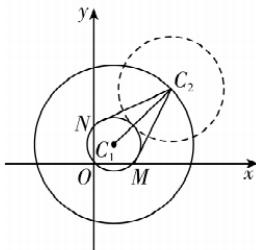

> [!faq]- 答案与解析
>
> > [!success]- **【答案】** A
>
> > [!note]- **【解析】**
> > A 【解析】对于圆 $C_{1}: x^{2} + y^{2} - 2x - 2y = 0$ ，整理可得圆 $C_{1}: (x - 1)^{2} + (y - 1)^{2} = 2$ ，
> > 可知圆心 $C_{1}(1,1)$ ，半径为 $\sqrt{2}$ 。令 x = 0，则 $y^{2}-2y=0$ ，解得 y=0 或 y=2，即 $N(0,2)$ ；
> > 令 y=0，则 $x^{2}-2x=0$ ，解得 x=0 或 x=2，即 $M(2,0)$ .
> >
> > 因为圆 $C_1$ 与 $C_2$ 相外切，所以 $\left|C_1C_2\right| = \sqrt{2} +2\sqrt{2} = 3\sqrt{2}$ ，可知点 $C_2(x,y)$ 的轨迹为以 $C_1$ 为圆心， $3\sqrt{2}$ 为半径的圆，则点 $C_2$ 的轨迹方程为 $(x - 1)^2 +(y - 1)^2 = 18,$ 可得 $\left|C_2M\right|^2 +\left|C_2N\right|^2 = \left[(x - 2)^2 +y^2\right]+\left[x^2 +(y - 2)^2\right] = 2\left[(x - 1)^2 +(y - 1)^2\right] +$ $4 = 40$ 则 $\left|C_2M\right|\cdot \left|C_2N\right|\leqslant \frac{\left|C_2M\right|^2 + \left|C_2N\right|^2}{2} =$ 20，当且仅当 $\left|C_2M\right| = \left|C_2N\right| = 2\sqrt{5}$ 时等号成立，所以 $\left|C_2M\right|\cdot \left|C_2N\right|$ 的最大值为20.故选A.
> >
> > 
