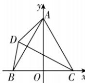

> [!faq]- 答案与解析
>
> > [!success]- **【答案】** B
>
> > [!note]- **【解析】**
> > $4 + 2\sqrt{13}$ 思路导引 在 $\triangle ABC$ 中，由 $\sin^2 A + \sin^2 B + \sin^2 C = 2\sqrt{3}\sin A\sin B\sin C$ ，利用正弦定理，结合余弦定理得到 $b^{2} + c^{2} = bc(\cos A + \sqrt{3}\sin A) = 2bc\sin \left(A + \frac{\pi}{6}\right)$ ，再利用基本不等式得到 $\sin \left(A + \frac{\pi}{6}\right) = 1$ ，此时 $b = c$ ，进一步得到 $\triangle ABC$ 为等边三角形，然后以 $BC$ 边的中点 $O$ 为原点， $OC$ 所在直线为 $x$ 轴， $OA$ 所在直线为 $y$ 轴，建立平面当 k=3 时， $O_{2}\left(-\frac{1}{8},-\frac{1}{8}\right)$ ， $r_{2}=\frac{3\sqrt{2}}{8}$ ，
> > 此时 $\frac{16-9\sqrt{2}}{24}<|O_{1}O_{2}|=\frac{\sqrt{34}}{24}<$ $\frac{16+9\sqrt{2}}{24}$ ，故 k=3 符合题意；
> > 当 k=4 时， $O_{2}\left(-\frac{1}{15},-\frac{1}{15}\right)$ ， $r_{2}=\frac{4\sqrt{2}}{15}$ ，
> > 此时， $|O_{1}O_{2}|=\frac{\sqrt{17}}{15}<\frac{10-4\sqrt{2}}{15}$ ，圆 $O_{1}$ 与圆 $O_{2}$ 内含，故 k=4 不符合题意.
> > 综上，k=2 或 k=3 符合题意. 故选 B.
> >
> > 直角坐标系, 设 $D(x,y)$ , 由 $|DC|=2|DB|$ , 得到点 $D$ 的轨迹, 进而得出 $|AD|$ 的最大值.
> >
> > 【解析】在 $\triangle ABC$ 中, 先由正弦定理得 $a^2+b^2+c^2=2\sqrt{3}bc\sin A$ , 再由余弦定理得 $a^2=b^2+c^2-2bc\cos A$ , 代入到 $a^2+b^2+c^2=2\sqrt{3}bc\sin A$ 中, 整理得 $b^2+c^2=bc(\cos A+\sqrt{3}\sin A)=2bc\sin(A+\frac{\pi}{6})$ , 则 $\sin(A+\frac{\pi}{6})=\frac{b^2+c^2}{2bc}\geqslant\frac{2bc}{2bc}=1$ , 当且仅当 $b=c$ 时等号成立, 又由 $\sin(A+\frac{\pi}{6})\leqslant 1$ , 所以 $\sin(A+\frac{\pi}{6})=1$ , 此时 $b=c$ ,
> >
> > 又因为 $0<A<\pi$ , 所以 $A+\frac{\pi}{6}=\frac{\pi}{2}$ , 所以 $A=\frac{\pi}{3}$ , 所以 $\triangle ABC$ 是等边三角形.
> >
> > 设 $BC$ 边的中点为 $O$ , 连接 $OA$ , 以 $BC$ 边的中点 $O$ 为原点, $OC$ 所在直线为 $x$ 轴, $OA$ 所在直线为 $y$ 轴, 建立平面直角坐标系, 如图所示,
> >
> > 则 $B(-3,0), C(3,0), A(0,3\sqrt{3})$ ，设 $D(x,y)$ ，由 $|DC| = 2|DB|$ ，得 $\sqrt{(x - 3)^2 + y^2} =$
> >
> > 
> >
> > $2\sqrt{(x+3)^{2}+y^{2}}$ ，整理得 $(x+5)^{2}+y^{2}=16$ 所以点 D 的轨迹是以 $T(-5,0)$ 为圆心，4 为半径的圆，
> > 又 $(0+5)^{2}+(3\sqrt{3})^{2}>16$ ，所以点 A 在圆 T 外部，所以 $|AD|$ 的最大值为 $|AT|+4=\sqrt{5^{2}+(3\sqrt{3})^{2}}+4=4+2\sqrt{13}$ .
