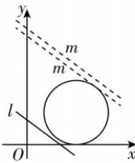

> [!faq]- 答案与解析
>
> > [!success]- **【答案】** $(-∞,-27]$
>
> > [!note]- **【解析】**
> > 由已知可得点 $P(x,y)$ 所在圆的方程为 $(x-3)^{2}+(y-2)^{2}=4$ ,
> > 设 $z = |3x + 4y + a| + |6 - 3x - 4y| = 5\left(\frac{|3x + 4y + a|}{\sqrt{3^{2} + 4^{2}}} + \frac{|3x + 4y - 6|}{\sqrt{3^{2} + 4^{2}}}\right)$ ,
> > 故 z 可看作点 P 到直线 m: $3x + 4y + a = 0$ 与直线 l: $3x + 4y - 6 = 0$ 距离之和的 5 倍，
> > 因为 $|3x+4y+a|+|6-3x-4y|$ 的值与 x,y 无关，所以这个距离之和与点 P 在圆上的位置无关.
> > 圆心（3,2）到直线 l 的距离为 $\frac{|3\times3+4\times2-6|}{\sqrt{3^{2}+4^{2}}}=\frac{11}{5}>2$ ，所以圆与直线 l 相离，如图所示，可知直线 m 平移时，点 P 与直线 m, l 的距离之和均为直线 m, l 之间的距离，
> >
> > 
> >
> > 此时可得圆在两直线之间，当直线 $m$ 与圆 $(x - 3)^2 +(y - 2)^2 = 4$ 相切时，有 $\frac{|3\times 3 + 4\times 2 + a|}{\sqrt{3^2 + 4^2}} = 2$ ，解得 $a = -7$ （舍去）或 $a = -27$ ，所以 $a\leqslant -27$ ，即实数 $a$ 的取值范围为 $(- \infty , - 27]$ 名师点拨本题解题的关键是将所求代数式转化为点 $P$ 到直线 $m:3x+$ $4y + a = 0$ 与直线 $l:3x + 4y - 6 = 0$ 距离之和的5倍.
