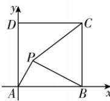

> [!faq]- 答案与解析
>
> > [!success]- **【答案】** B
>
> > [!note]- **【解析】**
> > B 【解析】设点 $P(x,y)$ ，以 A 为原点建立如图所示的平面直角坐标系，不妨设正方形边长为 1，则
> >
> > 
> >
> > $A(0,0),B(1,0),C(1,1)$ ,
> > 又 $|PA|:|PB|:|PC|=1:2:k$ ，所以 $|PB|^{2}=4|PA|^{2},|PC|^{2}=k^{2}|PA|^{2}$ ，
> > 则 $(x-1)^{2}+y^{2}=4(x^{2}+y^{2})$ ，整理得 $\left(x+\frac{1}{3}\right)^{2}+y^{2}=\frac{4}{9}$ 此时点 P 在以 $O_{1}\left(-\frac{1}{3},0\right)$ 为圆心，半径为 $r_{1}=\frac{2}{3}$ 的圆 $O_{1}$ 上.
> >
> > 又 $|PC|^{2}=k^{2}|PA|^{2}$ ，所以 $(x-1)^{2}+(y-1)^{2}=k^{2}(x^{2}+y^{2})$ 当 k=1 时，此时点 P 在线段 AC 的垂直平分线 y=-x+1 上，
> > 代入 $\left(x+\frac{1}{3}\right)^{2}+y^{2}=\frac{4}{9}$ 中，得 $3x^{2}-2x+1=0$ , $\Delta=4-12=-8<0$ , 方程无解, 所以 k=1 不符合题意.
> > 当 $k \neq 1$ 时, 整理得 $\left(x+\frac{1}{k^{2}-1}\right)^{2}+\left(y+\frac{1}{k^{2}-1}\right)^{2}=\frac{2k^{2}}{(k^{2}-1)^{2}}$ ,
> >
> > ## 刷难关
