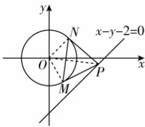

> [!faq]- 答案与解析
>
> > [!success]- **【答案】** $\left(\frac{1}{2},-\frac{1}{2}\right)$
>
> > [!note]- **【解析】**
> > 设点 P(m, n)，因为 P 在直线 l: x-y-2=0 上，所以满足 m-n-2=0，即 $m=n+2$ 。连接 OM, ON, OP。因为 PM, PN 是圆 C: $x^{2}+y^{2}=1$ 的切线，切点为 M, N，所以 $OM\perp PM, ON\perp PN$ ，所以 P, M, O, N 四点共圆，且该圆以 OP 为直径，圆心为 $\left(\frac{m}{2},\frac{n}{2}\right)$ ，半径为 $\frac{\sqrt{m^{2}+n^{2}}}{2}$ ，
> >
> > 点悟：∠OMP 和 ∠ONP 互补，根据四点共圆的判定定理可知四点共圆
> >
> > 则该圆的标准方程为 $\left(x-\frac{m}{2}\right)^{2}+\left(y-\frac{n}{2}\right)^{2}=\left(\frac{\sqrt{m^{2}+n^{2}}}{2}\right)^{2}$ ，展开并整理得 $x^{2}-mx+y^{2}-ny=0$ 。圆 C: $x^{2}+y^{2}=1$ 与上述圆的公共弦为 MN，将两圆方程相减，得 $mx+ny=1$ ，
> >
> > 由 $m=n+2$ ，代入 $mx+ny=1$ 得 $(n+2)\cdot x+ny=1$ ，整理得 $2x-1+n(x+y)=0$ ，
> >
> > 要使该方程对任意 n 恒成立，需令 n 的系数为 0 且等式为 0，即 $\left\{\begin{aligned}&2x-1=0,\\&x+y=0,\end{aligned}\right.$ 解得 $\left\{\begin{aligned}&x=\frac{1}{2},\\&y=-\frac{1}{2},\end{aligned}\right.$ 因此，直线 MN 恒过定点 $\left(\frac{1}{2},-\frac{1}{2}\right)$ 。
> >
> > 
> >
> > ## 刷易错
> >
> > ## ★易错点 两圆相切问题中考虑不全面漏解致误
