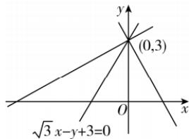

> [!faq]- 答案与解析
>
> > [!success]- **【答案】** D
>
> > [!note]- **【解析】**
> > D 【解析】因为直线 $\sqrt{3}x - y + 3 = 0$ 的斜率为 $\sqrt{3}$ ，所以倾斜角为 $\frac{\pi}{3}$ .
> > 因为直线 l 过点 $(0,3)$ ，且与直线 $\sqrt{3}x-y+3=0$ 及 x 轴围成等腰三角形，∴ 切线 l 的方程为 $5x + 12y - 37 = 0$ .
> > 综上可得，切线 l 的方程为 x = 5 或 $5x + 12y - 37 = 0$ .
> > (2) 设 $G(x, y), A(a, b), \because P(5, 1), Q(-1, -2), G$ 为 $\triangle APQ$ 的重心， $\therefore \left\{\begin{aligned}\frac{a+5-1}{3}&=x,\\ \frac{b+1-2}{3}&=y,\end{aligned}\right.$ 即 $\left\{\begin{aligned}a&=3x-4,\\ b&=3y+1,\end{aligned}\right.$ 由 A 为圆 $\rightarrow$ 敬黑板：重心坐标公式
> > C 上的动点，得 $(a-3)^{2}+(b-4)^{2}=4$
> >
> > 
> >
> > ## 第二章素养检测
> >
> > 所以当等腰三角形的腰在 x 轴上时, 直
> > → 避坑: 不确定等腰三角形的腰, 所以需要分类讨论
> > 线 l 的倾斜角为 $\frac{1}{2} \times \frac{\pi}{3} = \frac{\pi}{6}$ , 斜率为 $\frac{\sqrt{3}}{3}$ , 当等腰三角形的底边在 x 轴上时, 直线 l 的倾斜角为 $\pi - \frac{\pi}{3} = \frac{2\pi}{3}$ , 斜率为 $-\sqrt{3}$ ,
> > 所以由点斜式方程可得直线 l 的方程为 $y-3=-\sqrt{3}x$ 或 $y-3=\frac{\sqrt{3}}{3}x$ ,
> > 整理得直线 l 的方程为 $\sqrt{3}x + y - 3 = 0$ 或 $\sqrt{3}x - 3y + 9 = 0$ .
> >
> > 故选 **D**.
