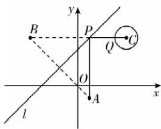
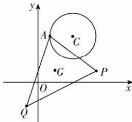

> [!faq]- 答案与解析
>
> > [!success]- **【答案】** C
>
> > [!note]- **【解析】**
> > C 【解析】由题意可知，圆 $C: (x - 4)^2 + (y - 4)^2 = 1$ 的圆心为 $C(4, 4)$ ，半径 $r = 1$ ，
> > 设点 $A(1, -1)$ 关于直线 $y = x + 3$ 的对称点的坐标为 $B(m, n)$ ，
> > 则 $\begin{cases} \frac{n + 1}{m - 1} = -1, \\ \text{AB与直线} y = x + 3\text{垂直} \\ \frac{n - 1}{2} = \frac{m + 1}{2} + 3, \\ \text{中点在直线} y = x + 3\text{上} \end{cases}$ 解得 $\begin{cases} m = -4, \\ n = 4, \end{cases}$ 即对称点 $B(-4, 4)$ ，则 $|BC| = \sqrt{(4 + 4)^2 + (4 - 4)^2} = 8.$ 因为反射光线与圆 $C$ 交于点 $Q$ ，则 $|AP| + |PQ| = |BP| + |PQ| \geqslant |BQ|$ ，当且仅当 $B, P, Q$ 三点共线时等号成立。又因为 $|BQ|_{\min} = |BC| - r = 8 - 1 = 7$ ，所以光线从点 $A$ 到点 $Q$ 经过的最短路线长为7。故选C。
> >
> > 
> >
> > $\therefore (3x - 4 - 3)^2 +(3y + 1 - 4)^2 = 4$ ，整理得 $\left(x - \frac{7}{3}\right)^2 +(y - 1)^2 = \frac{4}{9}$ 即动点 $G$ 的轨迹方程为 $\left(x - \frac{7}{3}\right)^2 +(y - 1)^2 = \frac{4}{9}$
> >
> > 
