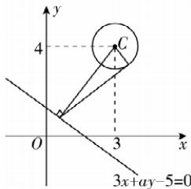

> [!faq]- 答案与解析
>
> > [!success]- **【答案】** C
>
> > [!note]- **【解析】**
> > C 【解析】由圆 $C:(x-3)^{2}+(y-4)^{2}=1$ ，得圆心 $C(3,4)$ ，过直线 $l:3x+ay-5=0$ 上任意一点作圆 C 的切线，要使切线长最小，即要使圆心到直线 l 上的点的距离最小，最小值为圆心到直线 l 的距离，根据题意作图，如图所示.
> >
> > 
> >
> > $\because$ 圆的半径为1，切线长的最小值为 $\sqrt{15},\therefore$ 圆心 $C$ 到直线 $l$ 的距离等于 $\sqrt{1^2 + (\sqrt{15})^2} = 4.$ 由点到直线的距离公式得 $\frac{|3\times 3 + 4a - 5|}{\sqrt{9 + a^2}} = 4,$ 解得 $a = 4.$ 此时直线 $l$ 的斜率为 $-\frac{3}{4}$
> >
> > 故选 **C**.
