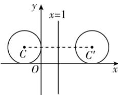

> [!faq]- 答案与解析
>
> > [!success]- **【答案】** B
>
> > [!note]- **【解析】**
> > B【解析】圆 $(x + 1)^2 +(y - 1)^2 = 1$ 的圆心为 $C(-1,1)$ ，半径 $r = 1$ 设点 $C(-1,1)$ 关于直线 $x = 1$ 的对称点为 $C^{\prime}(a,b)$ ，则 $\left\{ \begin{array}{l} \frac{-1 + a}{2} = 1,\\ b = 1, \end{array} \right.$ 解得 $\left\{ \begin{array}{ll} a = 3,\\ b = 1, \end{array} \right.$ 故 $C^\prime (3,1)$ ，则圆 $C^\prime$ 的方程为 $(x - 3)^2 +(y - 1)^2 = 1.$ 故选B.
> >
> > 
