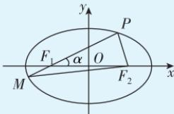

> [!faq]- 答案与解析
>
> > [!success]- **【答案】** C
>
> > [!note]- **【解析】**
> > C 【解析】根据题意, 点 A(-1,0), B(1,0), 则 $\left|AB\right|=2$ , 若动点 P 满足 $\left|PA\right|-\left|PB\right|=1$ , 且 $\left|AB\right|>\left|PA\right|-\left|PB\right|$ ,
> > →避坑：此处不是 $\left|\left|PA\right|-\left|PB\right|\right|=1$ ，故P的轨迹不是双曲线，只是双曲线的一支
> >
> > $\frac{1}{|PF_1|} + \frac{1}{|MF_1|} = \frac{2a}{b^2},$ $|MP| = \frac{2ab^2}{a^2 - c^2\cos^2\alpha}.$
> >
> > 
> >
> > 证明：
> > 在 $\triangle PF_{1}F_{2}$ 中，根据余弦定理，有 $\left|PF_{2}\right|^{2}=\left|PF_{1}\right|^{2}+\left|F_{1}F_{2}\right|^{2}-2\left|PF_{1}\right|\cdot\left|F_{1}F_{2}\right|\cdot\cos\alpha,$ 由椭圆定义 $\left|PF_{1}\right|+\left|PF_{2}\right|=2a$ 得 $(2a-\left|PF_{1}\right|)^{2}=\left|PF_{1}\right|^{2}+4c^{2}-4ccos\alpha\cdot\left|PF_{1}\right|,$ 整理得 $\left|PF_{1}\right|=\frac{b^{2}}{a-c\cos\alpha}.$ 在 $\triangle MF_{1}F_{2}$ 中， $\left|MF_{2}\right|^{2}=\left|MF_{1}\right|^{2}+\left|F_{1}F_{2}\right|^{2}-2\left|MF_{1}\right|\cdot\left|F_{1}F_{2}\right|\cdot\cos(\pi-\alpha)=(2a-\left|MF_{1}\right|)^{2},$ 整理得 $\left|MF_{1}\right|=\frac{b^{2}}{a+c\cos\alpha}.$ 所以 $\frac{1}{\left|PF_{1}\right|}+\frac{1}{\left|MF_{1}\right|}=\frac{2a}{b^{2}},$ $\left|MP\right|=\left|MF_{1}\right|+\left|PF_{1}\right|=\frac{2ab^{2}}{a^{2}-c^{2}\cos^{2}\alpha}.$
