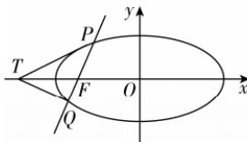

> [!faq]- 答案与解析
>
> > [!success]- **【答案】** A
>
> > [!note]- **【原始答案】** 详见解析
>
> > [!note]- **【解析】**
> > 【解】(1)由题意,得 $2c=2\sqrt{3}$ , 即 $c=\sqrt{3}$ , 则 $a^{2}-b^{2}=3$ , ①
> > 又点 $\left(-1,\frac{\sqrt{3}}{2}\right)$ 在椭圆 C 上,
> > 故 $\frac{(-1)^{2}}{a^{2}}+\frac{\left(\frac{\sqrt{3}}{2}\right)^{2}}{b^{2}}=1$ , ②
> > 联立①②解方程组得, $a^{2}=4,b^{2}=1$ , 所以椭圆 C 的方程为 $\frac{x^{2}}{4}+y^{2}=1$ .
> > (2) 假设存在点 $T(t,0)$ ，使得 $\angle PTF = \angle QTF$ 恒成立，易知点 $F(-\sqrt{3},0)$ .
> > 当直线 PQ 的倾斜角不为 0 时，设直线 PQ 的方程为 $x=my-\sqrt{3}(m\neq0)$ ， $P(x_{1},y_{1}),Q(x_{2},y_{2})$ 联立 $\left\{\begin{aligned}&x=my-\sqrt{3}\\ &\frac{x^{2}}{4}+y^{2}=1,\end{aligned}\right.$ 消去 x 整理得 $(m^{2}+4)y^{2}-2\sqrt{3}my-1=0$ ，易知 $\Delta>0$ ，
> > 则由根与系数的关系得， $y_{1}+y_{2}=\frac{2\sqrt{3}m}{m^{2}+4},y_{1}y_{2}=\frac{-1}{m^{2}+4}.$ ( \* )
> > 若满足 $\angle PTF = \angle QTF$ ，则 $k_{PT} + k_{QT} = 0$ ，即 $\frac{y_{1}}{x_{1}-t} + \frac{y_{2}}{x_{2}-t} = 0$ ，整理得， $y_{1}(x_{2}-t)+y_{2}(x_{1}-t)=0$ ，
> > 又 $x_{1}=my_{1}-\sqrt{3},x_{2}=my_{2}-\sqrt{3}$ ，代入上式得， $y_{1}(my_{2}-\sqrt{3}-t)+y_{2}(my_{1}-\sqrt{3}-t)=0$ ，
> > 整理得， $2my_{1}y_{2}-(t+\sqrt{3})(y_{1}+y_{2})=0$ ，将（\*）式代入上式得
> >
> > $2m\left(-\frac{1}{m^{2}+4}\right)-\left(t+\sqrt{3}\right)\frac{2\sqrt{3}m}{m^{2}+4}=0,$ 又 $m \neq 0$ , 解得 $t = -\frac{4\sqrt{3}}{3}$ .
> > 当直线 PQ 的倾斜角为 0 时，点 $T\left(-\frac{4\sqrt{3}}{3},0\right)$ 满足 $\angle PTF = \angle QTF.$ 综上, 存在点 $T\left(-\frac{4\sqrt{3}}{3},0\right)$ 使得 $\angle PTF = \angle QTF$ 恒成立.
> >
> > 
