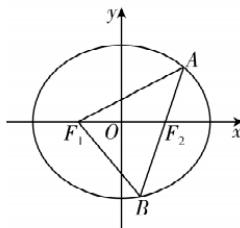

> [!faq]- 答案与解析
>
> > [!success]- **【答案】** A
>
> > [!note]- **【原始答案】** 详见解析
>
> > [!note]- **【解析】**
> > 【解】(1)由题知 $\left|PF_{1}\right|$ 的最大值为 $a+c$ ，则 $a+c=3①$ 当点 P 为上顶点 $(0, b)$ 时， $k_{PF_{1}}=\frac{b-0}{0+c}=\frac{b}{c}=\tan\frac{\pi}{3}=\sqrt{3}$ ②，又因为 $a^{2}=b^{2}+c^{2}$ ③，由①②③得 $a=2, b=\sqrt{3}, c=1$ ，所以椭圆 C 的标准方程为 $\frac{x^{2}}{4}+\frac{y^{2}}{3}=1$ .
> > (2) 设 $A(x_{1}, y_{1}), B(x_{2}, y_{2})$ ，易知点 $F_{1}(-1,0), F_{2}(1,0)$ .
> > (i)由题意可知直线 l 的方程为 y = x - 1，联立 $\left\{\begin{aligned}y&=x-1,\\ 3x^{2}&+4y^{2}=12,\end{aligned}\right.$ 得 $7x^{2}-8x-8=0$ ，则 $\Delta=64+4\times7\times8=288>0$ ，由根与系数的关系可得 $x_{1}+x_{2}=\frac{8}{7}$ ， $x_{1}x_{2}=-\frac{8}{7}$ ，所以 $\left|AB\right|=\sqrt{1+1^{2}}\cdot\sqrt{(x_{1}+x_{2})^{2}-4x_{1}x_{2}}=\sqrt{2}\times\sqrt{\left(\frac{8}{7}\right)^{2}-4\times\left(-\frac{8}{7}\right)}=\frac{24}{7}.$ (ii) 易知直线 AB 与 x 轴不重合，设直线 AB 的方程为 $x=my+1$ ，
> >
> > 
> >
> > 联立 $\left\{\begin{aligned}my&=x-1,\\ 3x^{2}+4y^{2}&=12,\end{aligned}\right.$ 得 $(3m^{2}+4)y^{2}+6my-9=0$ ，则 $\Delta=36m^{2}+36(3m^{2}+4)=144(m^{2}+1)>0$ ，
> > 由根与系数的关系可得 $y_{1} + y_{2} = -\frac{6m}{3m^{2}+4}, y_{1}y_{2} = -\frac{9}{3m^{2}+4}$ ，所以 $|y_{1}-y_{2}|=\sqrt{(y_{1}+y_{2})^{2}-4y_{1}y_{2}}=\sqrt{\left(-\frac{6m}{3m^{2}+4}\right)^{2}-4\times\left(-\frac{9}{3m^{2}+4}\right)}=$ $\frac{12\sqrt{m^{2}+1}}{3m^{2}+4}$ ,
> > 所以 $\triangle F_{1}AB$ 的面积为 $S=\frac{1}{2}|F_{1}F_{2}|$ $|y_{1}-y_{2}|=\frac{1}{2}\times2\times\frac{12\sqrt{m^{2}+1}}{3m^{2}+4}=$ $\frac{12\sqrt{m^{2}+1}}{3m^{2}+4}=$ $\frac{12\sqrt{m^{2}+1}}{3(m^{2}+1)+1}=$ $\frac{12}{3\sqrt{m^{2}+1}+\frac{1}{\sqrt{m^{2}+1}}}$ 令 $t=\sqrt{m^{2}+1}\geqslant1$ ，则函数 $y=3t+\frac{1}{t}$ 在 $[1,+\infty)$ 上单调递增，故当 t=1，即 m=
> > 避坑：不能使用基本不等式求最值，t 取不到使不等式等号成立的值
> > 0 时，S 取最大值，且 $S_{max}=\frac{12}{3+1}=3$ .
> >
> > ## 刷素养
