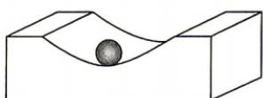

<!-- question-source:start -->
4.[辽宁沈阳东北育才中学2026高二期中]一个工业凹槽的轴截面是双曲线的一部分,它的方程是 $y^{2}-x^{2}=1,y\in[1,10]$ ,在凹槽内放入一个清洁钢球(规则的球体),要求清洁钢球能擦净凹槽的最底部,则清洁钢球的最大半径为()

错题本

建议用时:65 分钟 答案 P176
A. 1    B. 2
C. 3    D. $\sqrt{2}$
<!-- question-source:end -->

![[Q00072373A1]]
