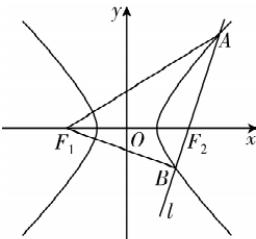

> [!faq]- 答案与解析
>
> > [!success]- **【答案】** A
>
> > [!note]- **【解析】**
> > A 【解析】由题意可得 $a^{2}=4 \Rightarrow 2a=4$ ， $\triangle ABF_{1}$ 的周长为 $\left|AF_{1}\right| + \left|BF_{1}\right| + \left|AB\right|$ ，
> > 由双曲线的定义可得 $\left|AF_{1}\right|-\left|AF_{2}\right|=\left|BF_{1}\right|-\left|BF_{2}\right|=4$ ，又 $\left|AF_{2}\right|+\left|BF_{2}\right|=\left|AB\right|=2$ ，
> > 所以 $\left|AF_{1}\right|+\left|BF_{1}\right|+\left|AB\right|=\left|AF_{1}\right|-\left|AF_{2}\right|+\left|BF_{1}\right|-\left|BF_{2}\right|+2\left|AB\right|=4+4+4=12$ ，
> > 所以 $\triangle ABF_{1}$ 的周长为 12，故选 A.
> >
> > 
