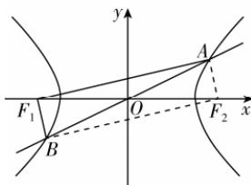

> [!faq]- 答案与解析
>
> > [!success]- **【答案】** B
>
> > [!note]- **【解析】**
> > B【解析】由双曲线的对称性以及A,B是双曲线上关于原点对称的两点可知,点O是线段AB的中点.
> > 连接 $AF_{2}$ ， $BF_{2}$ ，又 $|AB|=2c=|F_{1}F_{2}|$ ，所以四边形 $AF_{1}BF_{2}$ 为矩形，所以 $AF_{1}\perp BF_{1},|BF_{1}|=|AF_{2}|$ .
> >
> > 由双曲线 $C: \frac{x^2}{9} - \frac{y^2}{7} = 1$ 可得 $a = 3, b = \sqrt{7}$ , 则 $c = \sqrt{a^2 + b^2} = \sqrt{9 + 7} = 4$ , 所以 $|AB| = |F_1F_2| = 2c = 8$ , 所以 $|AF_1|^2 + |BF_1|^2 = |AB|^2 = 64$ . 又 $||AF_1| - |BF_1|| = ||AF_1| - |AF_2|| = 2a = 6$ , 所以 $|AF_1|^2 + |BF_1|^2 - 2|AF_1||BF_1| = 36$ , 解得 $|AF_1||BF_1| = 14$ , 所以 $S_{\triangle ABF_1} = \frac{1}{2}|AF_1||BF_1| = 7$ . 故选 B.
> >
> > 
