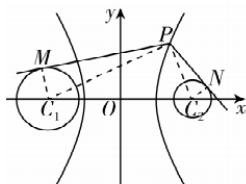

> [!faq]- 答案与解析
>
> > [!success]- **【答案】** B
>
> > [!note]- **【解析】**
> > B【解析】由双曲线方程 $\frac{x^2}{4} -\frac{y^2}{12} = 1$ 可知， $a = 2,b = 2\sqrt{3},c = \sqrt{a^2 + b^2} = 4.$ 圆 $C_1:(x + 4)^2 +y^2 = 3$ 的圆心为 $C_1(-4,0)$ ，半径为 $r_1 = \sqrt{3}$ ；圆 $C_2$ ： $(x - 4)^2 +y^2 = 1$ 的圆心为 $C_2(4,0)$ ，半径为 $r_2 = 1$ ，则双曲线的左、右焦点分别为 $C_1,C_2$ .如图，连接 $PC_{1},PC_{2},$ $C_1M,C_2N,$ 则 $MC_1\bot PM,NC_2\bot PN,$
> >
> > 
> >
> > 可得 \( (\overrightarrow{PM}+\overrightarrow{PN})\cdot\overrightarrow{NM}=(\overrightarrow{PM}+\overrightarrow{PN})\cdot(\overrightarrow{PM}-\overrightarrow{PN})=|\overrightarrow{PM}|^{2}-|\overrightarrow{PN}|^{2}=(|PC\_{1}|^{2}-r\_{1}^{2})-(|PC\_{2}|^{2}-r\_{2}^{2})=(|PC\_{1}|^{2}-3)-(|PC\_{2}|^{2}-1)=|PC\_{1}|^{2}-|PC\_{2}|^{2}-2=(|PC\_{1}|-|PC\_{2}|)\cdot(|PC\_{1}|+|PC\_{2}|)-2=2a(|PC\_{1}|+$|PC_{2}|)-2\geqslant2a\cdot2c-2=2\times2\times2\times4-2=30$ , 当且仅当点 P 的坐标为 $(2,0)$ 时取等号, 因此 $(\overrightarrow{PM}+\overrightarrow{PN})\cdot\overrightarrow{NM}$ 的最小值为 30.
> >
> > 故选 **B**.
