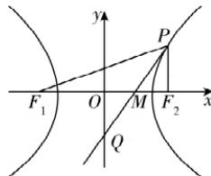
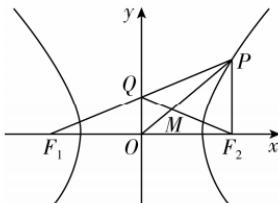

> [!faq]- 答案与解析
>
> > [!success]- **【答案】** C
>
> > [!note]- **【解析】**
> > C
> >
> > 思路导引
> > 先由双曲线方程得到 a, b, c 的关系, 再由 $PF_{2} \perp x$ 轴求得 $P(\sqrt{2}a, a)$ 设 $\angle F_{1}PF_{2}$ 的平分线与 x 轴交于点 M，结合角平分线定理与双曲线的定义求得 $\frac{|MF_{1}|}{|MF_{2}|}=3$ 得到 $M\left(\frac{\sqrt{2}}{2}a,0\right)$ 由 P, M, Q 三点共线得到关于 a 的方程，求解即可得到 a 的值
> > 【解析】由双曲线 $E: x^{2}-y^{2}=a^{2}$ 得 $\frac{x^{2}}{a^{2}}-\frac{y^{2}}{a^{2}}=1$ ，故 $a^{2}=b^{2}, c^{2}=a^{2}+b^{2}=2a^{2}$ ，即 $a=b, c=\sqrt{2}a, F_{1}(-c,0), F_{2}(c,0)$ ，设 $\angle F_{1}PF_{2}$ 的平分线与 x 轴交于点 M，如图.
> >
> > 
> >
> > 因为 $PF_{2} \perp x$ 轴，所以可设 $P(c, y_{1})$ ( $y_{1}>0$ ) ，代入双曲线方程 $x^{2}-y^{2}=a^{2}$ 得
> > 点悟：因为 $P$ 在第一象限，所以 $y_{1}>0$ $c^{2}-y_{1}^{2}=a^{2}$ ，故 $y_{1}^{2}=c^{2}-a^{2}=b^{2}$ ，则 $y_{1}=b$ ，即 $P(c,b)$ ，即 $P(\sqrt{2}a,a)$ .
> > 因为 $|PF_{1}|-|PF_{2}|=2a, |PF_{2}|=a$ ，所以 $|PF_{1}|=2a+|PF_{2}|=3a$ ，
> > 又因为 $PM$ 平分 $\angle F_{1}PF_{2}$ ，所以 $\frac{|MF_{1}|}{|MF_{2}|}=\frac{|PF_{1}|}{|PF_{2}|}=3.$ 又 $|MF_{1}|+|MF_{2}|=|F_{1}F_{2}|=2c=2\sqrt{2}a$ ，所以 $|MF_{2}|=\frac{\sqrt{2}}{2}a$ ，则 $|OM|=|OF_{2}|-|MF_{2}|=\frac{\sqrt{2}}{2}a$ ，即 $M\left(\frac{\sqrt{2}}{2}a,0\right)$ .
> > 因为 $P,M,Q$ 三点共线，所以 $k_{PM}=k_{PQ}$ ，即 $\frac{a}{\sqrt{2}a-\frac{\sqrt{2}}{2}a}=\frac{a+2}{\sqrt{2}a}$ ，解得 $a=2$ . 故选 C. $\frac{12}{13}$ 【解析】由题意可知，点 $M$ 为$\triangle PF_{1}F_{2}$ 的重心，又因为 $F_{2}, M, Q$ 三
> > → 点悟：由 $OP$ 为中线， $OM = \frac{1}{3} OP$ 可得， $M$ 为 $\triangle PF_{1}F_{2}$ 的重心
> > 点共线，所以 $Q$ 为线段 $PF_{1}$ 的中点，
> > 所以 $OQ//PF_{2}$ ，即 $PF_{2} \perp F_{1}F_{2}$ ，且 $|PF_{2}| = 2|OQ| = \frac{5}{2}$ .
> > 由双曲线的定义可得 $|PF_{1}| = 2a + \frac{5}{2}$ ，所以 $\left(2a + \frac{5}{2}\right) + \frac{5}{2} + 2c = 15$ ，所以 $a + c = 5①$ .
> > 将 $x = c$ 代入双曲线的方程可得 $\frac{c^2}{a^2} - \frac{y^2}{b^2} = 1$ ，可得 $y^2 = b^2\left(\frac{c^2}{a^2} - 1\right) = \frac{b^4}{a^2}$ ,
> > 由题意知，点 $P$ 在第一象限，则 $y_P = \frac{b^2}{a} = \frac{c^2 - a^2}{a} = \frac{5}{2}$ ②，结合①②可得 $a = 2, c = 3, |PF_1| = 4 + \frac{5}{2} = \frac{13}{2}$ ，在Rt $\triangle PF_{1}F_{2}$ 中， $\sin \angle F_{1}PF_{2} = \frac{|F_{1}F_{2}|}{|PF_{1}|} = \frac{12}{13}$ .
> >
> > 
