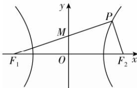

> [!faq]- 答案与解析
>
> > [!success]- **【答案】** A
>
> > [!note]- **【解析】**
> > A 【解析】如图，
> >
> > 
> >
> > 因为 $|F_{1}O|=3|OM|$ ，所以 $\tan\angle PF_{1}F_{2}=\frac{1}{3}$ 。又 $PF_{1}\perp PF_{2}$ ，所以 $\frac{|PF_{2}|}{|PF_{1}|}=\frac{1}{3}$ ，且 $|PF_{1}|-|PF_{2}|=2a$ ，所以 $|PF_{1}|=3a$ ， $|PF_{2}|=a$ 。
> > 又 $|PF_{1}|^{2}+|PF_{2}|^{2}=|F_{1}F_{2}|^{2}\Rightarrow9a^{2}+a^{2}=4c^{2}\Rightarrow5a^{2}=2c^{2}$ 所以 $\frac{b^{2}}{a^{2}}=\frac{c^{2}}{a^{2}}-1=\frac{3}{2}$ 所以双曲线的渐近线方程为 y = $\pm\frac{b}{a}x=\pm\frac{\sqrt{6}}{2}x.$
> >
> > 故选 **A**.
