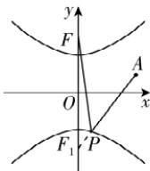

> [!faq]- 答案与解析
>
> > [!success]- **【答案】** B
>
> > [!note]- **【解析】**
> > B 【解析】由 $\frac{y^{2}}{4}-\frac{x^{2}}{5}=1$ ，得a=2,b= $\sqrt{5}$ ，所以 $c=\sqrt{a^{2}+b^{2}}=3$ ，所以上焦点 $F(0,3)$ ，则下焦点为 $F_{1}(0,-3)$ .
> >
> > 避坑：注意此题是焦点在 $y$ 轴上的双曲线如图，连接 $PF_{1}$ ，又 $A(3,1)$ ，由双曲线的定义得 $\vert PF\vert +\vert PA\vert = 2a + \vert PF_1\vert +$ $\vert PA\vert \geqslant 2a + \vert AF_1\vert = 4 + \sqrt{3^2 + (1 + 3)^2} =$
> >
> > 9, 由图知, 当 A, P, $F_{1}$ 三点共线 (P 在线段 $AF_{1}$ 上) 时, $|PF| + |PA|$ 取得最小值 9. 故选 B.
> >
> > 
