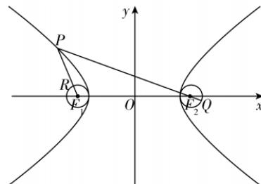

> [!faq]- 答案与解析
>
> > [!success]- **【答案】** B
>
> > [!note]- **【解析】**
> > B【解析】在双曲线 $C_1$ 中， $a = 4,b = 3,c = 5$ ，易知两圆圆心分别为双曲线 $C_1$ 的两个焦点.记点 $F_{1}(-5,0),F_{2}(5,0)$ ，当 $\mid PQ\mid -|\mathrm{PR}|$ 取最大值时， $P$ 在双曲线 $C_1$ 的左支上，如图所示，
> >
> > 
> >
> > 所以 $|PQ| - |PR| \leqslant |PF_2| + 1 - (|PF_1| - 1) = |PF_2| - |PF_1| + 2 = 2a + 2 = 10.$
> >
> > 故选 **B**.
