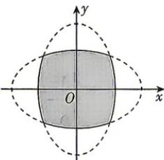

<!-- question-source:start -->
7. (多选) [天津河北区 2026 高二期中] 如图所示, 两个椭圆 $\frac{x^{2}}{25} + \frac{y^{2}}{9} = 1, \frac{y^{2}}{25} + \frac{x^{2}}{9} = 1$ 内部重叠区域的边界记为曲线 $C, P$ 是曲线 $C$ 上的任意一点, 则下列结论正确的是 ( )

A. 两个椭圆的离心率相等
B. $P$ 到 $F_{1}(-4,0), F_{2}(4,0), E_{1}(0,-4), E_{2}(0,4)$ 四点的距离之和为定值
C. 曲线 $C$ 关于直线 $y = x$ , $y = -x$ 均对称
D. 曲线 $C$ 所围区域面积必小

<!-- question-source:end -->

![[Q00072293A1]]
