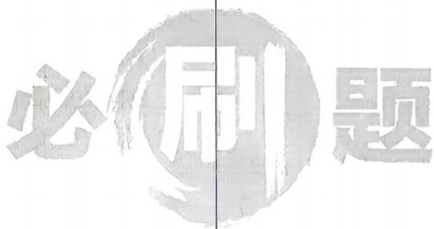

<!-- question-source:start -->
12.[北京大学附属中学2026高二期中]已知椭圆 $C:\frac{x^{2}}{a^{2}}+\frac{y^{2}}{b^{2}}=1(a>b>0)$ ，其离心率为 $\frac{1}{2}$ ，且过点 $H\left(1,\frac{3}{2}\right)$ .

(1) 求椭圆 C 的标准方程；

(2) 设椭圆 C 的左、右顶点分别为 A 和 B，求直线 HA, HB 的斜率之和；

(3) 过点 $T(4,0)$ 的直线 $l_{2}$ 交椭圆 $C$ 于 $P, Q$ 两点 (异于点 $H$ ), 设直线 $HP, HQ$ 的斜率分别为 $k_{1}, k_{2}$ , 证明: $k_{1} + k_{2}$ 为定值.

错题本

## 刷能力
<!-- question-source:end -->

![[Q00072298A1]]
