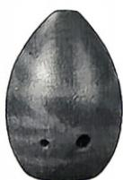
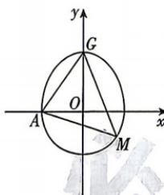

<!-- question-source:start -->
2.[江西南昌2025高二期中]吹奏乐器“埙”(如图①)在古代通常是用陶土烧制的,一种“埙”的外轮廓的上部是半椭圆,下部是半圆,已知半椭圆 $\frac{y^{2}}{a^{2}}+\frac{x^{2}}{b^{2}}=1(y\geqslant0,a>b>0$ 且为常数)和半圆 $x^{2}+y^{2}=b^{2}(y<0)$ 组成的曲线C如图②所示,曲线C交x轴的负半轴于点A,交y轴的正半轴于点G,点M是半圆上任意一点,当点M的坐标为 $\left(\frac{\sqrt{2}}{2},-\frac{1}{2}\right)$ 时, $\triangle AGM$ 的面积最大,则半椭圆的方程是()

图①
图②

A. $\frac{4x^2}{3} +\frac{y^2}{2} = 1(y\geqslant 0)$ B. $\frac{16x^2}{9} +\frac{y^2}{3} = 1(y\geqslant 0)$ C. $\frac{2x^2}{3} +\frac{4y^2}{3} = 1(y\geqslant 0)$ D. $\frac{4x^2}{3} +\frac{2y^2}{3} = 1(y\geqslant 0)$
<!-- question-source:end -->

![[Q00072300A1]]
