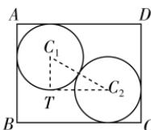

> [!faq]- 答案与解析
>
> > [!success]- **【答案】** A
>
> > [!note]- **【原始答案】** $8+4\sqrt{2}$
>
> > [!note]- **【解析】**
> > 设两圆圆心分别为 $C_{1}, C_{2}$ ，过点 $C_{1}$ 作 $C_{1}T \perp BC$ ，过点 $C_{2}$ 作 $C_{2}T \perp AB$ ，交 $C_{1}T$ 于点 $T$ . 令 $\angle C_1C_2T = \theta, AB = a, BC = b$ , 则 $a = 2 + 2\sin \theta, b = 2 + 2\cos \theta, \theta \in \left(0, \frac{\pi}{2}\right), \therefore (a - 2)^2 + (b - 2)^2 = 4$ , 而 $(a - 2)^2 + (b - 2)^2 \geqslant \frac{(a + b - 4)^2}{2}$ , 即 $(a + b - 4)^2 \leqslant 8$ , 当且仅当 $a = b = 2 + \sqrt{2}$ 时等号成立, 则 $(a + b)_{\max} = 4 + 2\sqrt{2}$ , 故长方形 $ABCD$ 周长的最大值为 $8 + 4\sqrt{2}$ .
> >
> > 
