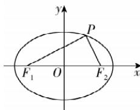

> [!faq]- 答案与解析
>
> > [!success]- **【答案】** BCD
>
> > [!note]- **【解析】**
> > BCD 【解析】由椭圆 C 的方程可得
> > a=5, b=3, $c=\sqrt{a^{2}-b^{2}}=4$ .
> >
> > 
> >
> > 对于 A: $\triangle PF_{1}F_{2}$ 的周长为 $|PF_{1}| + |PF_{2}| + |F_{1}F_{2}| = 2a + 2c = 18$ , A 错误; 对于 B: 设 $P(x_{0}, y_{0}), 0 < |y_{0}| \leqslant 3$ , 则 $S_{\triangle PF_{1}F_{2}} = \frac{1}{2} |F_{1}F_{2}| \cdot |y_{0}| \leqslant 4 \times 3 = 12$ , B 正确; 对于 C: 由 $c > b$ , 得以原点 O 为圆心, $c$ 为半径的圆与椭圆相交, 当 P 为此交点时, $\angle F_{1}PF_{2} = 90^{\circ}$ , 因此存在点 P, 使得 $\angle F_{1}PF_{2} = 90^{\circ}$ , C 正确; 对于 D: $|PF_{1}| = \sqrt{(x_{0} + 4)^{2} + y_{0}^{2}} = \sqrt{x_{0}^{2} + 8x_{0} + 16 + 9 - \frac{9x_{0}^{2}}{25}} = \sqrt{\frac{16x_{0}^{2}}{25} + 8x_{0} + 25} = 5 + \frac{4}{5} x_{0}$ , 又 $x_{0} \in$ 点悟: 利用点在椭圆上得到 $x_{0}, y_{0}$ 的关系, 利用消元法把问题转化为关于 $x_{0}$ 的函数问题 $(-5, 5)$ , 所以 $5 + \frac{4}{5} x_{0} \in (1, 9)$ , $|PF_{1}| \cdot |PF_{2}| = |PF_{1}| (10 - |PF_{1}|) = -(|PF_{1}| - 5)^{2} + 25 \in (9, 25]$ , D 正确.
> >
> > 故选 **BCD**.
