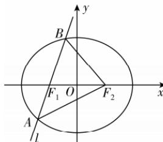

> [!faq]- 答案与解析
>
> > [!success]- **【答案】** B
>
> > [!note]- **【解析】**
> > B 【解析】如图, 不妨令 $F_{1}, F_{2}$ 分别为椭圆 C 的左、右焦点, $\triangle ABF_{2}$ 的周长 $L = |AB| + |AF_{2}| + |BF_{2}| = |AF_{1}| + |AF_{2}| + |BF_{1}| + |BF_{2}| = 4a$ ,
> > 又由椭圆 $C:\frac{x^{2}}{4}+\frac{y^{2}}{3}=1$ , 得 a=2 , 所以 $\triangle ABF_{2}$ 的周长为 8 , 故选 B.
> >
> > 
