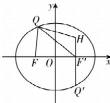

> [!faq]- 答案与解析
>
> > [!success]- **【答案】** D
>
> > [!note]- **【解析】**
> > D 【解析】因为椭圆 $C: \frac{x^{2}}{4} + \frac{y^{2}}{3} = 1$ ，所以 a = 2, $b = \sqrt{3}$ , c =
> >
> > 
> >
> > 1, $F(-1,0)$ ，则椭圆的右焦点为 $F'(1,0)$ ，由椭圆的定义得 $|QH| + |QF| = |QH| + 2a - |QF'| \leqslant |HF'| + 2a =$ 点悟：利用三角形两边之差小于第三边
> >
> > 5，当点 Q 在点 $Q'$ 处时取等号，所以 $|QH| + |QF|$ 的最大值为 5，故选 D.
> >
> > 1, 即 $\sin \alpha - 2\cos \alpha = 4$ ，而 $\sin \alpha - 2\cos \alpha = \sqrt{5}\sin (\alpha - \varphi) \in [-\sqrt{5}, \sqrt{5}]$ ，其中 $\cos \varphi = \frac{1}{\sqrt{5}}$ ， $\sin \varphi = \frac{2}{\sqrt{5}}$ ， $\because 4 \notin [-\sqrt{5}, \sqrt{5}]$ ， $\therefore$ 点 $\left(\frac{1}{4}, \frac{1}{2}\right)$ 不在直线 $l$ 上，故 D 正确。方法二：由 C 知 $l$ 为圆 $x^2 + y^2 = 1$ 的切线，而点 $\left(\frac{1}{4}, \frac{1}{2}\right)$ 在圆 $x^2 + y^2 = 1$ 的内部，故点 $\left(\frac{1}{4}, \frac{1}{2}\right)$ 不在直线 $l$ 上，D 正确。
> >
> > 故选 **BCD**。
